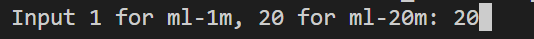

# SeqRecWarmup

本仓库为工科创IV-G小组的课程成果。
本仓库着重讨论了在推荐系统冷启动问题上的测评平台与demo实验。
我们的项目目标与意义详见PPT

## 1. 所用数据集

我们使用了MovieLens-1m和MovieLens-20m数据集，代码内部会自行下载与预处理。

## 2. 使用说明
首先安装环境：

```bash
pip install -r requirements.txt
```

### 2.1 BERT4Rec与BERT4Rec+ASReP/backtrack
运行main.py，通过如下指令能进行训练或测试。
训练
```bash
python main.py --template train_bert
```
推理、测试（这里的测试checkpoint我们hardcode为我们的预训练版本）
```bash
python main.py --template train_bert --ticks 20 --mode test --bert_backtrack_len 3 --max-ticks 100 
```

这里以测试命令为例，解释此后的命令行交互：
- 开始运行后，命令行会请你输入选择MovieLens-1m或MovieLens-20m. (输入1或20)
   
- 此后，命令行会请你输入测试平台分割用时间戳，对于我们的demo来说，直接输入0，表示遵从传统不分割。此后"Input Size of test"输入1，也与传统测试一致。
   
- 此后测试开始，demo中将会比较BERT4Rec原始和BERT4Rec加上反向数据增强的效果，并将图片保存在`MyImages`文件夹中。


## 3. demo实验结果
### 3.1 MovieLens-1m


### 3.2 MovieLens-20m


## 4. 其他
如果对于代码以及本项目有任何问题，可以<b>随时联系我们！</b>
另外感谢丁玥老师和助教学长！感谢几位组员！